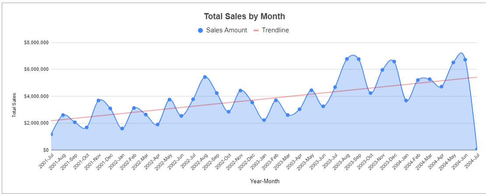
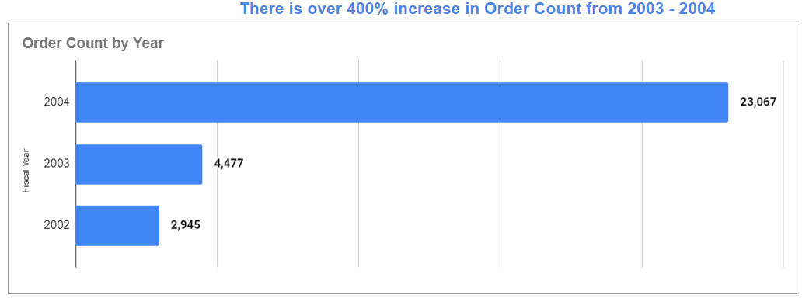

# Adventure Works Data Analysis

## Introduction
Utilizing Spreadsheets for Data Analytics

[Here](https://docs.google.com/spreadsheets/d/1Bj3_QSUIZgid2VxZ16RUAj_-VLu5QIiE15DhA8jmG5U/edit?gid=1562610257#gid=1562610257) is a link to the google spreadsheet.

## ASK PHASE:
**Business would like to see the monthly sales trend:**

* Has there been a rise or a decrease in monthly sales over the years? and What is the possible reason ?
* What is the sales of online orders vs Non-Online orders?

## PREPARE:

**The required data include:**

1. The Order Date (to extract month and year of sales).
2. Salesperson data
3. Countries Data
4. Sales Reason data
5. Sales Data

## Visualization:

SHARE

Conclusions:
1. The data reveals a consistent seasonal sales pattern across the years 2002, 2003, and 2004, with August being the peak month for sales and January and October experiencing the lowest sales volume.

2. There's a clear seasonal trend with August showing high sales in each of the three years. This suggests a potential link between the product and summer months.

3. January and October consistently have the lowest sales figures, indicating a potential post-holiday slump (January) and pre-holiday lull (October) in customer buying behavior.

4. There is an average 50% Year on Year increase in sales due to yearly increase in order count.

5. There is a massive 400% increase in order count from 2003 to 2004.

6. A high percentage of orders were placed online (87%) but a larger portion of the sales revenue comes from offline channels (76%).
This can be due to High Order Value Offline where Customers might be placing smaller orders online (e.g., for refilling supplies) and making larger, more expensive purchases offline (e.g.,experiencing the product firsthand).

7. Linda and Jillian are the top performers by both order volume and sales. This suggests they're not just generating a high number of orders, but also converting those orders into successful sales.

8. Southwest United States territory has been driving highest sales across the years.

9. Most sales made were price driven.

Thank You 😄 🙂 😊

